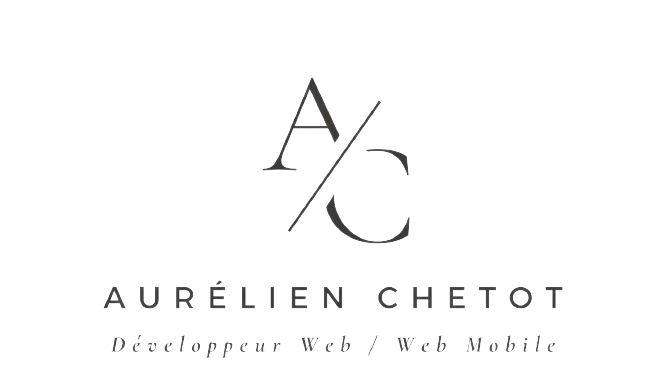

<h1 align="center">Welcome to Portefolio A/C 💻 </h1>
<p align="center">
  
</p>

# Portfolio de Aurélien CHETOT

Bienvenue sur mon portfolio ! Je suis [Ton Nom], un développeur passionné par [tes intérêts ou spécialités].

## À propos de moi

Je suis en formation de Developpeur Web/Web mobile FullStack. J'ai travaillé dans diverses entreprises, acquérant une solide expérience dans ma vie professionel. Je suis passionné par l'informatique et le developpement et je suis toujours à la recherche de nouveaux défis stimulants.

# 🌐 Dev with:

[](https://developer.mozilla.org/en-US/docs/Web/Guide/HTML/HTML5)
[](https://developer.mozilla.org/en-US/docs/Web/CSS)
[](https://developer.mozilla.org/en-US/docs/Web/JavaScript)
[](https://sass-lang.com/)
[](https://reactjs.org/)
[](https://git-scm.com/)
[](https://github.com/)

## Install

```sh
npm install
```

## Author

👤 **Aurélien CHETOT**

[](https://github.com/AurelienChetot)
[](https://www.linkedin.com/in/aur%C3%A9lien-chetot-6861852b2/)

## Mes Projets

### [Qui?Zip](https://aurelienchetot.github.io/Projet-1-Team-3/)

- Description : Allez essayer notre Quiz de la Tech..
- Technologies utilisées : HTML, CSS, JavaScript.

### [Star-Wild](https://star-wild.netlify.app/)

- Description : Partez à la visite du système solaire dans une expérience 3D.
- Technologies utilisées : ReactJs, NodeJs, SASS, ThreeJs.

### [Splitter](https://star-wild.netlify.app/)

- Description : Checkpoint 02 : Diviser l'addition et calculer le pourboire / personne.
- Technologies utilisées : HTML, CSS, JavaScript.

...

## Me contacter

Si vous souhaitez discuter de projets potentiels, de collaborations ou simplement dire bonjour, n'hésitez pas à me contacter :

- Email : aurelien.chetot@gmail.com
- LinkedIn : https://www.linkedin.com/in/aur%C3%A9lien-chetot-6861852b2/
- GitHub : https://github.com/AurelienChetot
- Site Web : https://portfolio-aurelienchetot.netlify.app/

N'hésitez pas à explorer mes projets ci-dessus et à me contacter pour toute question ou opportunité de collaboration ! Merci de visiter mon portfolio.
